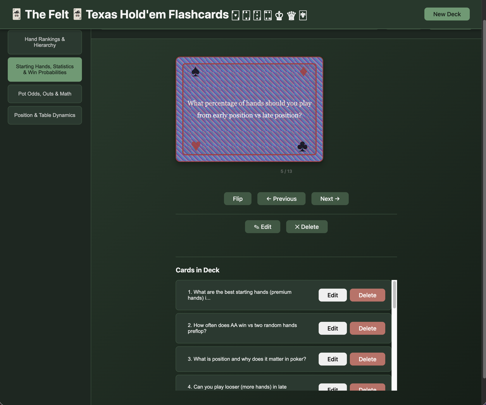

# 🃏 The Felt — Texas Hold'em Flashcards

**The Felt** is a browser-based flashcard study app built with vanilla JavaScript, HTML, and CSS — no frameworks, no dependencies. Inspired by Texas Hold'em poker, it features a dark green felt surface, 54-card deck aesthetics, and a playing card flip mechanic that makes hand rankings and strategy feel like you're actually sitting at the tables.

---

## Overview

The Felt is a single-page flashcard application built to study Texas Hold'em poker strategy, hand rankings, odds, and table dynamics through an interactive card-flipping interface. The app supports full deck and card management — create, edit, and delete both decks and individual cards — with all data persisted across sessions using the browser's LocalStorage API.

The application was developed using a structured AI-assisted workflow. GitHub Copilot provided both inline code suggestions and larger feature scaffolding through targeted seed prompts — pre-written, context-specific prompts designed to generate precise output that integrates directly with the existing codebase structure. Each prompt was refined iteratively, reviewed critically, and corrected where the AI produced inconsistent or inaccessible output.

The app ships with four pre-built Texas Hold'em poker decks covering hand rankings and hierarchy, starting hand strategy and win probabilities, pot odds and mathematics, positional play and table dynamics. Additional decks and cards can be created directly within the app and can include any topic that you choose to add to the deck. 

---

## Screenshot



---

## Live Demo

[](https://zstem001hz-droid.github.io/flashcards-app/)

---

## Features

- **Multiple Decks** — Create, rename, and delete custom flashcard decks
- **Card CRUD** — Add, edit, and delete cards with front (question) and back (answer) fields
- **Study Mode** — Flip cards, navigate with Previous/Next, and shuffle the deck order
- **Keyboard Navigation** — Space to flip, ArrowLeft/ArrowRight to navigate
- **Search** — Case-insensitive keyword search within the active deck
- **LocalStorage Persistence** — Decks and cards survive page refresh; last active deck is restored
- **Accessible Modals** — Focus trap, ESC to close, focus returns to opener on dismiss
- **Playing Card Aesthetic** — Cards styled as realistic playing cards with suit coloring, corner indices, face card treatment, and a decorative card back pattern
- **Responsive Layout** — Two-column sidebar/main layout on desktop, single column on mobile
- **Dark Mode** — Felt-themed dark green color scheme with `prefers-color-scheme` support
- **Empty States** — Contextual messages for no decks and no cards conditions

---

## Tech Stack

- **HTML5** — Semantic structure with `header`, `aside`, `main`, `article`, `footer`, `dialog`
- **CSS3** — CSS variables, CSS Grid, Flexbox, 3D flip animation, `aspect-ratio`, responsive media queries
- **Vanilla JavaScript** — No frameworks, no build tools, no dependencies
- **Web Storage API** — LocalStorage for state persistence
- **GitHub Copilot** — AI-assisted development (see Reflection section)

---

## Project Structure

```
flashcards-app/
├── .github/
│   └── copilot-instructions.md   # Persistent Copilot context file
├── scripts/
│   └── app.js                    # All application logic
├── styles/
│   └── style.css                 # All styles
├── index.html                    # Single HTML entry point
└── README.md
```

---

## Getting Started

No build tools or dependencies required.

**Option 1 — Open directly in browser:**
```
Open index.html in any modern browser
```

**Option 2 — Live Server (VS Code):**
```
Right-click index.html → Open with Live Server
```

**Option 3 — Clone and run:**
```bash
git clone https://github.com/zstem001hz-droid/flashcards-app.git
cd flashcards-app
open index.html
```

---

## Pre-loaded Decks

The app seeds four Texas Hold'em poker decks on first load:

| Deck | Focus |
|---|---|
| Hand Rankings & Hierarchy | Poker hand values from high card to royal flush |
| Starting Hands, Statistics & Win Probabilities | Hole card strategy and preflop win rates |
| Pot Odds, Outs & Math | Calculating pot odds, counting outs, implied odds |
| Position & Table Dynamics | Positional advantage, table position strategy |

---

## Data Model

```javascript
AppState = {
  decks: [{ id, name, createdAt }],
  cardsByDeckId: {
    [deckId]: [{ id, front, back, createdAt, updatedAt }]
  },
  activeDeckId: string | null,
  ui: {
    isModalOpen: boolean,
    activeCardIndex: number,
    isFlipped: boolean
  }
}
```

State is serialized to `localStorage` under the key `flashcardsAppState` on every change and restored on page load.

---

## Keyboard Shortcuts

| Key | Action |
|---|---|
| `Space` | Flip current card |
| `ArrowLeft` | Previous card |
| `ArrowRight` | Next card |
| `Escape` | Close open modal |

---

## Accessibility

- All interactive elements have `aria-label` or associated `<label>` elements
- Modal dialogs use native `<dialog>` element with `showModal()` / `close()`
- Focus is trapped within open modals (Tab cycles within)
- Focus returns to the opener element when a modal closes
- Visible focus styles on all focusable elements
- Error messages use `role="alert"` for screen reader announcement
- `aria-invalid` set on inputs with validation errors

---

## AI Collaboration Reflection

This project was built as a structured exploration of AI-assisted development using GitHub Copilot in VS Code.

### Where AI Saved Time

GitHub Copilot generated the complete HTML semantic skeleton, full CSS variable system with responsive grid layout, playing card visual design (CSS only, no images), and the entire AppState management pattern including LocalStorage serialization — all from targeted seed prompts. Work that would have taken significantly longer to write and debug manually was scaffolded in minutes, leaving more time for review, refinement, and understanding the output.

### Missing Feature Caught During Review

GitHub Copilot's initial HTML skeleton omitted the New Card button from the toolbar entirely — the layout included Shuffle but not the card creation control required by the app spec. Catching this required reading the generated output critically against the requirements rather than accepting it at face value. The button was added manually with the correct ID, class, and aria-label attributes to match the existing pattern.

### How Prompts Were Refined

Broad prompts produced large, unfocused outputs that missed requirements or invented structure that conflicted with existing code. Replacing them with targeted prompts that referenced specific element IDs already in the HTML — for example, specifying "using the existing dialog elements deck-modal and card-modal from index.html" — produced code that integrated directly without conflicts. The copilot-instructions.md context file eliminated the need to restate the data model, file paths, and naming conventions in every prompt.

### Accessibility Decisions

GitHub Copilot consistently applied accessible patterns throughout: native `<dialog>` elements with `showModal()`, `aria-label` on all interactive controls, `role="alert"` on error messages, `aria-invalid` on invalid inputs, and visible focus styles on all focusable elements. One addition made during review: the deck list was confirmed to use semantic `<button>` elements inside `<li>` items rather than non-interactive divs, ensuring keyboard navigability and correct screen reader announcement.

### Key Insight

AI-assisted development requires the same critical thinking as writing code manually — arguably more, because the output looks complete and correct even when it isn't. The most valuable skill was knowing what questions to ask: does this match the spec, is this accessible, will this cause a memory leak, what is this code actually doing?

### AI Bug Identified and Fixed

GitHub Copilot's `ModalManager.closeModal()` used `.bind(this)` inline when calling `removeEventListener`, which creates a new function reference each time and prevents the listener from matching the one added in `openModal` — causing the ESC key handler to leak and accumulate on every modal open. The fix was to store the bound reference as `boundHandleEscKey` on the ModalManager object, assigning it once in `openModal` and passing the same reference to both `addEventListener` and `removeEventListener`.

### Prompt Changes That Improved Output

Vague prompts like *"create a flashcard app"* produced one large monolithic output that skipped accessibility and missed requirements. Targeted prompts that referenced specific element IDs from the existing HTML (e.g., *"using the existing dialog elements deck-modal and card-modal from index.html"*) produced code that plugged directly into the existing structure without conflicts. Including the `.github/copilot-instructions.md` context file meant Copilot consistently used the correct class naming convention, file paths, and data model without needing to re-state them in every prompt.

---

## Author

**Zac White**

---

## License

MIT

### Process Reflection: Design vs. Completion

A significant portion of development time was spent on visual styling and card aesthetic decisions before the core application requirements were fully implemented. Iterating on card back patterns, color schemes, and layout proportions during active development created context-switching overhead and contributed to inefficient use of GitHub Copilot's session rate limits. In hindsight, the correct sequence was to complete all functional requirements first — CRUD, search, shuffle, seed data — then address visual polish as a separate phase. The assignment required working functionality, not visual perfection, and prioritizing aesthetics before completion introduced unnecessary complexity and technical debt during the most critical phase of development.